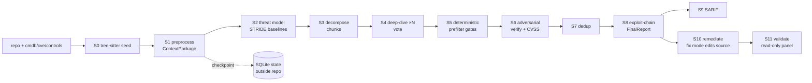

# Analyzing VVAH — Visa's Agentic SAST Pipeline

> **Source:** [visa/visa-vulnerability-agentic-harness](https://github.com/visa/visa-vulnerability-agentic-harness) @ [`3d972f6`](https://github.com/visa/visa-vulnerability-agentic-harness/commit/3d972f679d8f5e3838b394edee0b5ea9c626b0fb) (v1.2.0, 2026-08-04)

## Overview

VVAH ("vvaharness") is Visa's open-source, agentic SAST pipeline: an 11-stage, 4-phase pipeline that uses frontier LLMs for autonomous vulnerability discovery, remediation, and fix validation. It is built on learnings from Anthropic's [Project Glasswing](https://www.anthropic.com/glasswing) initiative. Released under Apache-2.0 with Python ≥ 3.11, it runs `scan` (S0–S9 detection), `remediate` (S10), and `validate` (S11) from a single CLI.

The design thesis, stated up front in the README: **the bottleneck in AI-assisted vulnerability management is triage speed, not discovery** — the primary effectiveness metric is Mean Time to Adapt (MTTA), from AI-discovered exploitability to a validated fix in production. Three choices drive finding quality: threat modeling *before* analysis, multi-agent deterministic voting to cut false positives, and structured triage artifacts.

## How It Works

VVAH is a pipeline of prompt-defined "skills" interleaved with deterministic gates. Each LLM stage is a composable skill (a system prompt + a JSON output contract); deterministic stages (S5 prefilter, S9 SARIF emission, dedup, taint seeding) do real work without spending tokens, and every stage's output is a typed pydantic model threaded through the pipeline.

The flow: a repo is surveyed into a `ContextPackage` (S1), threats are modeled in business context (S2, STRIDE + OWASP/MASVS/IaC baselines), the codebase is decomposed into prioritized `Chunk`s (S3 — taint chunks ranked above LLM risk chunks, plus catch-all coverage sweeps and six specialist lens passes), each chunk is deep-dived by the LLM (S4, optionally N runs with majority voting), findings pass deterministic confidence/evidence gates (S5), each survivor gets an adversarial second-opinion verifier (S6, TRUE_POSITIVE/FALSE_POSITIVE + CVSS 3.1), findings are deduplicated semantically (S7), chained into multi-hop exploit paths and re-ranked (S8), and emitted as Markdown + SARIF 2.1.0 (S9). S10 walks findings one at a time with a remediation agent (fix mode applies diffs); S11 runs a read-only adversarial panel (security-architect + penetration-tester personas) scoring each fix against weighted gates.

All LLM traffic goes through a vendor-neutral transport layer (`backends/llm.py`) that dispatches on each role's `via:` — `cli` (Claude Code subprocess), `sdk` (Anthropic Python SDK), `openai` (OpenAI-compatible), or `deepagents` (LangGraph harness, S10/S11 only). Roles can mix backends within one run; the shipped `default.yaml` runs detection on Claude Code and remediation/validation on DeepAgents over the Anthropic API.

## Architecture

```
vvaharness/
  cli.py                      — console entry: setup / doctor / estimate / scan / remediate / validate / gc
  orchestrator/               — drivers: entry.py, scan.py, batch.py, preflight.py,
  │                             store.py (SQLite checkpoints), checkpoints.py, cmdb.py
  models.py (1.8k LOC)        — pydantic contracts: ContextPackage, ThreatModel, TaskManifest,
  │                             Finding, FinalReport + taint/reflection/framework fact models
  pipeline/stages/            — s0_seed … s9 (s5/s9 deterministic), s11_validate hook
  │   callgraph_engine/       — tree-sitter scan (_scan.py, 2.9k LOC), interprocedural graph
  │                             (_graph.py), rule loader (_rules.py), LLM annotator (_annotator.py)
  backends/                   — llm.py dispatcher; claude_cli.py, sdk.py, oai.py, agent_sdk.py,
  │                             localtools.py (sandboxed Read/Glob/Grep), harness/ (DeepAgents)
  remediation_agent/          — S10: playbooks, policy gate, plugin runner, fix applier
  validation/                 — S11: session launcher, personas, weighted-gate scoring, consensus
  report/                     — enrich.py (CVSS/CWE/SARIF), redact.py (secret/PII masking)
  rules/                      — CWE KB (generic.kb.yaml) + build_kb.py (Semgrep/FindSecBugs/CodeQL → KB)
  lang/                       — 42 language hints, 132-extension map, ts_graph.py
  config/profiles/            — default.yaml, sdk.yaml, full.yaml, taint.yaml
```



State is checkpointed per stage in a SQLite DB at `$VVAHARNESS_STATE_DIR/vvaharness.db` (default `~/.vvaharness/state/`) — deliberately **never inside the scanned repo** — with per-run `run_manifest.json` (models, config hash, target SHA, timing) written to the working directory.

## The Spine

Trace `vvaharness scan --repo X`: `cli.py` → `orchestrator/entry.py` (argparse, config resolution, `.env` load) → `preflight.py` (credential/backend probes; missing post-scan creds warn rather than abort) → `scan_repo()` in `orchestrator/scan.py`:

1. Derive a path-based `run_id`, register the run in the SQLite store, purge stale checkpoint rows (unless `--resume`).
2. Optionally run `s1_autoexclude` — an AI survey that derives a per-target exclusion overlay *before* S1 (on by default).
3. S0: tree-sitter static seed — build a source→sink callgraph before any LLM runs (rules mode needs operator-supplied source/sink YAML; with none it returns an empty seed and S1 proceeds).
4. S1–S8 as described above; S4 and S6 run chunks/findings concurrently through `ThreadPoolExecutor` with a cooperative Ctrl-C abort that hard-kills in-flight `claude` process trees.
5. S9 emits `<target>/security-scan/<module>_<ts>_report.{md,sarif}` plus `*_errors.jsonl` only when non-fatal errors occurred.
6. S10 `remediate` walks findings (top-N by CVSS), applies minimal diffs in fix mode, writes per-finding DTOs to `<target>/security-remediation/<NN_slug>/`; a policy gate can deny/allow CWE maps and revert forbidden-path edits, with a `VVAHARNESS_REMEDIATE_DISABLE` / `.vvaharness-remediate-off` kill-switch.
7. S11 `validate` discovers validatable DTOs (no model spend), runs the adversarial panel, and writes back verdicts (`validated` / `validation_failed` / `needs_review`); `validated` is terminal, failed stays re-validatable.

> [!warning]
> The shipped default profile enables S10 fix mode and S11 in-scan — a plain `vvaharness scan` **edits source files in the target repo**. Detection-only requires `--stop-after s9`.

## Key Patterns

- **Deterministic-first, LLM-second.** Every expensive LLM stage is preceded or followed by cheap deterministic work: tree-sitter callgraph seeding, regex call-graph supplementation, config-file structural dedup, S5 confidence/evidence gates, line-bucketed canonicalization, CVSS/CWE/SARIF enrichment. Tokens are spent only where pattern matching can't decide.
- **Roles as backend-agnostic config.** Each model role is a config node (`{id, via, …}`); the dispatcher in `backends/llm.py` routes to `cli`/`sdk`/`openai`, and post-scan roles go through the DeepAgents harness with per-provider routing. Same prompt code, swappable transport, mixed-vendor panels refused at startup.
- **Lenient LLM-output coercion.** `models.py` wraps every strict Literal/Enum/int field in `field_validator(mode="before")` coercers (`_coerce_enum`, `_coerce_int`, `_coerce_confidence`) that map common synonyms and fall back to safe defaults — an off-schema value degrades one finding instead of killing the run.
- **Defense-in-depth security posture** (see below).
- **Parallelism with bounded retries.** `claude_cli.py` retries genuine transients (429/502/503/529, connection drops, Claude-Code "pending result" placeholders) with exponential backoff; subprocess timeouts retried once. Retry is classification-gated — hard usage-cap messages and canned guardrail refusals are *not* retried.

## Non-Obvious Details

- **Majority voting is temperature-gated.** `_effective_runs()` in `s4_deepdive.py` collapses `runs`/`vote_threshold` to 1/1 for `via: cli` (no temperature control) and for SDK models that reject `temperature` (Opus 4.7+/Sonnet 5+), because N identical-temperature runs are N copies of one output. Real voting only engages with temperature-capable models (e.g. Opus 4.6 at `temperature: 1.0`) — so the shipped default profile's "multi-agent voting" is effectively off, with S5+S6 as the FP defense. The code clamps unreachable thresholds instead of silently dropping all findings.
- **The CFG is a reserved schema, not a shipped feature.** `models.py` defines `CFGNode`/`CFG`/`ConditionTaintEdge`, and the architecture doc notes the scanner "does not populate a branch CFG or perform branch-/path-sensitive analysis." The `condition` transfer edge is a placeholder for future work.
- **Checkpoints are hostile-input aware.** State payloads are JSON, validated via pydantic `validate_json` (never pickle — CWE-502); a belt-and-braces check refuses `--resume` if the checkpoint dir resolves inside the target tree. A malicious repo cannot pre-plant executable state; at worst a tampered payload fails validation and the stage re-runs.
- **Source is redacted before it leaves the process**, not just in output files: `s4_deepdive.py` masks PANs (keeping BIN prefix + length so "test PAN in source" findings stay detectable) before packing code into prompts, and `localtools` runs `Read`/`Grep` results through `redact_counts()` before returning them to the model.
- **Auto-exclusion can narrow scope silently.** `step1.auto_exclude: true` (shipped) lets an AI survey derive per-target exclusions — the security doc explicitly warns this lets repo content "quietly narrow what gets scanned," recommending `--no-auto-step1` for sensitive targets.
- **S0 rules mode ships no rule pack.** No source/sink corpus is bundled (`pyproject.toml` uses an explicit allowlist so org overlays are never packaged); without operator-supplied YAML, S0 returns an empty seed and the pipeline falls through to agentic S1. Taint-first scanning is therefore not turnkey.
- **Doc drift:** `docs/SKILLS.md` §6 still documents a `vvaharness/taint/` engine, but the taint engine moved to `pipeline/stages/callgraph_engine/` in v1.2.0; the `sdk.yaml` S11 launcher also has a documented credential split (`ANTHROPIC_SDK_API_KEY` covers S1–S10 but not S11) that `doctor` can false-green.

## Assessment

**Strengths.** This is the most prompt-injection-conscious agentic code tool I've analyzed: no shipped profile grants Bash, `sdk`/`openai` agents run in a jailed Read/Glob/Grep loop (`_jail()` rejects traversal, symlink escapes, unbounded reads), CLI permission mode defaults to `acceptEdits` (never `bypassPermissions`), and the S11 panel is strictly read-only with fail-closed verdict scoring. The deterministic-between-LLM-stages structure is a sound architecture for cutting token spend and hallucination. Honest documentation: limitations (no accuracy numbers, elevated privilege, token costs, no build/test of patched trees) are stated up front, and there's a real test suite — 98 test files covering redaction, path safety, permission gates, UNC-path guards, verdict integrity, and batch security. The remediation kill-switch and policy gate are well-designed guard rails for an auto-editing agent.

**Concerns.** No published precision/recall figures, so the core value claim (FP reduction via voting/threat-modeling) is unverified — and the default profile's voting is disabled by the temperature gate anyway. Cost control is advisory: phase buckets *account* for tokens but don't enforce caps, and `run_manifest.json.per_stage_cost` is still `null`. Remediation applies fixes without compiling, building, or testing the patched tree. S0's value depends on operator-supplied rule packs that must be generated with `build_kb.py` from Semgrep/FindSecBugs/CodeQL inputs. The repo is explicitly closed to external code contributions.

**Recommendations.** Publish accuracy numbers (Glasswing-style evaluation) to back the design claims; make a bundled source/sink seed pack available for taint-first to be turnkey; enforce (not just meter) budget caps on the SDK/OpenAI paths; fix the `taint/` doc drift. Otherwise this is a strong reference design for anyone building agentic security tooling — the trust-boundary work is the part worth copying.

## Related

- [[analyzing-agent-scan]] — Snyk's agentic code-analysis CLI, same problem space
- [[analyzing-zer0vuln]] — LLM-driven zero-day vulnerability detection
- [[analyzing-stride-gpt]] — LLM threat modeling with STRIDE
- [[analyzing-pentagi]] / [[analyzing-pentestagent]] — agentic pentesting harnesses (offensive counterpart)
